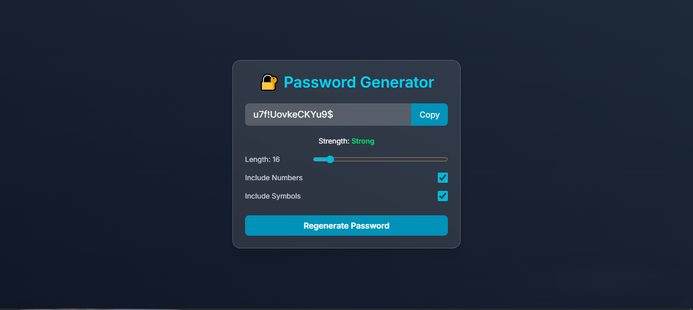

# 🔐 Password Generator

A sleek, secure, and fully responsive Password Generator built with **React (Vite)** and **Tailwind CSS**.  
Generate strong passwords instantly, customize length and character options, and copy securely with a single click.

---



> ⚡ **Live Demo**: [Visit on Vercel →](https://securepass-generator-app.vercel.app/)

---

## 🚀 Features

- ✅ Instant password generation  
- 🔁 Manual regenerate button  
- 🔢 Length, numbers, and symbol toggle  
- 🟢 Password strength indicator (Weak, Medium, Strong)  
- 📋 One-click copy to clipboard with animated toast  
- 💅 Responsive, modern glassmorphism UI  

---

## 🛠️ Tech Stack

| Tech            | Description                    |
|-----------------|--------------------------------|
| **Vite**        | Fast frontend tooling          |
| **React.js**    | UI library                     |
| **Tailwind CSS**| Utility-first CSS framework    |
| **Vercel**      | Deployment platform            |

---

## ⚙️ How to Run Locally

```bash
# 1. Clone the repo
git clone https://github.com/vednav9/securepass-generator.git
cd password-generator

# 2. Install dependencies
npm install

# 3. Run the app
npm run dev
```

Then open `http://localhost:5173` in your browser.

---

## 📁 Folder Structure

```
password-generator/
├── public/
├── src/
│   └── App.jsx
│   └── App.css
├── index.html
├── package.json
└── tailwind.config.js
```

---

## 🌐 Deployment

This project is deployed on **[Vercel](https://vercel.com/)** for instant access:

🔗 **Live URL**: [https://securepass-generator-app.vercel.app/](https://securepass-generator-app.vercel.app/)

---

## 🙌 Acknowledgements

- [React](https://react.dev)  
- [Vite](https://vite.dev/)
- [Tailwind CSS](https://tailwindcss.com)  
- [Vercel](https://vercel.com)  

---

### 🔗 Connect With Me

Made by Vedant Navthale (https://github.com/vednav9)
